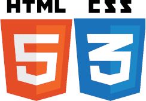

# Repositório Público de Eduardo Magno

Meus arquivos compilados aqui para facilitar a organização

## CursoemVídeo

Todos os cursos que fiz no [CursoemVídeo](https://www.cursoemvideo.com).

### HTML5 e CSS3

Os módulos 1, 2 e 3 do **Curso de HTML5 e CSS3** do CursoemVídeo, com os desafios e exercícios atualizados, de acordo com os vídeos postados no [canal do YouTube](https://www.youtube.com/cursoemvideo)

[Clique aqui](https://github.com/magaldimagno/html-css) para acessar o repositório

### JavaScript

Meus arquivos do **Curso de JavaScript** do CursoemVídeo, com os desafios e exercícios atualizados, de acordo com os vídeos postados no [canal do YouTube](https://www.youtube.com/cursoemvideo)

[Clique aqui](https://github.com/magaldimagno/javascript) para acessar o repositório